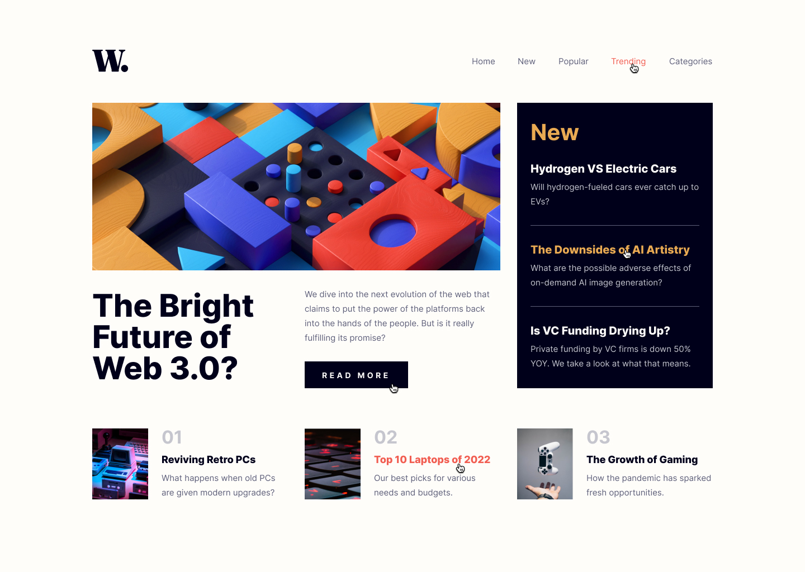
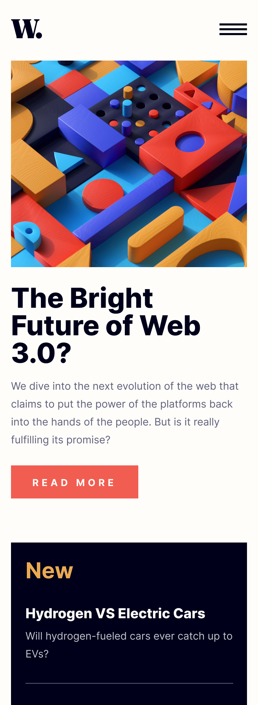
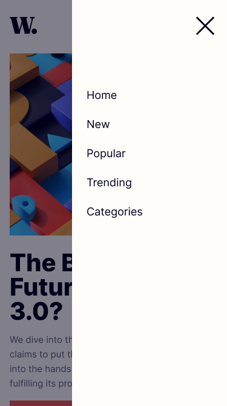

# Amalitech lab-2 - News homepage solution

This is a solution to the [News homepage challenge on Frontend Mentor](https://www.frontendmentor.io/challenges/news-homepage-H6SWTa1MFl). 

## Table of contents

- [Overview](#overview)
  - [The challenge](#the-challenge)
  - [Screenshot](#screenshot)
  - [Links](#links)
- [My process](#my-process)
  - [Built with](#built-with)
  - [What I learned](#what-i-learned)
  - [Commands used](#git-commands-used)
  - [Continued development](#continued-development)
  - [Useful resources](#useful-resources)
- [Author](#author)

## Overview

### The challenge

Users should be able to:

- View the optimal layout for the interface depending on their device's screen size
- See hover and focus states for all interactive elements on the page

### Screenshots
-A full view of the desktop mode.



-A cropped view of the mobile mode. The image is long.



-A view of the mobile menu.



### Links

- Solution URL: [Github](https:github.com/proc3ssa/lab2-GTP)
- Live Site URL: [Vercel](https://newswebsite-liart.vercel.app/)

## My process

### Built with

- Semantic HTML5 markup
- CSS custom properties
- Flexbox
- Mobile-first workflow
- JavaScript

### What I learned

-Proper translation of UI design to code.
- Implementing a responsive navigation bar that adapts to different screen sizes.
- Using CSS Flexbox for layout and alignment.
- Creating a mobile menu that toggles on and off using JavaScript.
- Applying hover and focus states to interactive elements for better user experience.
- Styling the page using CSS custom properties for maintainability.

```html
<header class="navbar">
  <div class="logo">
    
  </div>
  <div class="menu-toggle" id="menuToggle">
    
  </div>

  <nav class="desktop-menu">
    <ul>
      <li><a href="#">Home</a></li>
      <li><a href="#">New</a></li>
      <li><a href="#">Popular</a></li>
      <li><a href="#">Trending</a></li>
      <li><a href="#">Categories</a></li>
    </ul>
  </nav>
</header>
```

```css
.navbar {
  display: flex;
  justify-content: space-between;
  align-items: center;
  padding: 16px;
  background: var(--almost-white);
}

@media (min-width: 768px) {
  .desktop-menu ul li{
    display: inline;
  }
}
```

```javascript
const menuToggle = document.getElementById('menuToggle');
const mobileMenu = document.getElementById('mobileMenu');
const overlay = document.getElementById('overlay');

menuToggle.addEventListener('click', () => {
  mobileMenu.classList.add('open');
  overlay.classList.add('show');
});
```


## Git commands used

Here are the git commands used during the project.

---

### Git init

 
**Description:**  
The git init command is used to inialize a git repository, Making the files in that folder trackable by git.

---
### Git add .

 
**Description:**  
The git add command is used to stage files in the project. In staging the files are being tracked, and they are waiting for them to be committed.

---


### Git switch -c header

 
**Description:**  
This git command is used to create and switch to a branch called header, and switch to that branch.

---

### Git checkout

 
**Description:**  
The git command is used to switch branches, and also restore a previous version of a file.

---


### Git swicth -c article

 
**Description:**  
The git command was used to create and switch to a branch named article.

---

## Git swicth -c top_body

 
**Description:**  
The git command was used to create and switch to a branch named top_body.

---

## git merge header

 
**Description:**  
The git command was used merge the hearder branch to main.

---

## git merge top-body

 
**Description:**  
The git command was used merge the top_body branch to main.

---

## git merge down-body

 
**Description:**  
The git command was used merge the down body elements branch to main.

---

## git log

 
**Description:**  
The git command was used to show logs of changes effected in the repo.

---


### Continued development

- Improve accessibility by ensuring proper semantic HTML structure.
- Write unit tests to ensure the JavaScript functionality is robust.
- Explore CSS Grid for more complex layouts in future projects.
- Optimize CSS for better performance and maintainability.

### Useful resources

- [Frontend Mentor](https://www.frontendmentor.io) - For providing the challenge and design specifications.
- [MDN Web Docs](https://developer.mozilla.org/en-US/) - For HTML, CSS, and JavaScript documentation and tutorials.
- [CSS-Tricks](https://css-tricks.com/) - For CSS layout techniques and best practices.

## Author

- Website - [Faisal Halid Dene](https://github.com/Proc3ssa)

- Twitter - [P R O C E S S O R](https://www.x.com/processor_911)


